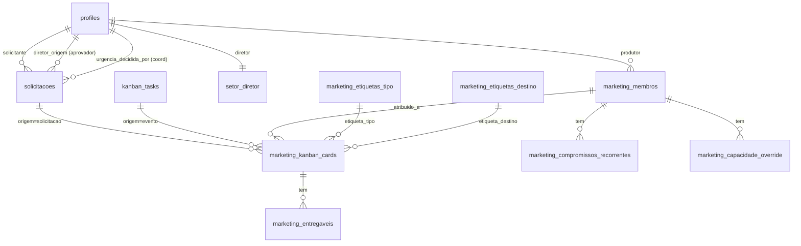

# Módulo Marketing — Modelagem de Dados (Fase 6)

> **Status:** v1.0 · 2026-05-28
> **Pré-requisito:** ADRs aprovados (`04-adrs.md`)
> **Próxima fase:** Fase 7 — Segurança e Conformidade (`06-seguranca-autorizacao.md`)

---

## 1. Inventário de entidades

### 1.1 Mudanças no `solicitacoes` (TRANSVERSAL · spec 001)

| Entidade | Propósito | Volume estimado |
|---|---|---|
| `solicitacoes` (estendida) | Adiciona aprovação hierárquica · urgência decidida pelo coord | já existe |
| `setor_diretor` (nova) | Mapping setor → diretor (apenas 3 linhas) | 3 |

### 1.2 Novas tabelas do Marketing

| Entidade | Propósito | Volume estimado/ano |
|---|---|---|
| `marketing_membros` | Equipe + habilidades + horas semanais | ~10 |
| `marketing_etiquetas_tipo` | Categoria do entregável (Artes/Vídeos/etc) | 8 |
| `marketing_etiquetas_destino` | Contexto do entregável (Interno/Externo/etc) | 5 |
| `marketing_kanban_cards` | Cards do Kanban (3 origens) | ~520 (10/sem × 52) |
| `marketing_entregaveis` | Arquivos no SharePoint anexados ao card | ~520 |
| `marketing_capacidade_override` | Ajuste pontual de horas por semana (férias/eventos) | ~50 |
| `marketing_compromissos_recorrentes` | Slots fixos (Aline domingo · Allan quarta · Lorena diário) | 3-10 |

Volume baixo · não é gargalo de escala.

---

## 2. Diagrama Entidade-Relacionamento



---

## 3. Schema detalhado (SQL completo)

### 3.1 Delta no Solicitações (spec 001 transversal)

```sql
-- 1. Tabela de mapping setor → diretor
CREATE TABLE public.setor_diretor (
  setor         text PRIMARY KEY,
  diretor_id    uuid NOT NULL REFERENCES profiles(id),
  diretor_nome  text NOT NULL,
  updated_at    timestamptz NOT NULL DEFAULT now()
);

INSERT INTO public.setor_diretor (setor, diretor_id, diretor_nome) VALUES
  ('Gestão',      '<eduardo_uuid>',      'Eduardo Gnisci'),
  ('Criativo',    '<pedro_menezes_uuid>', 'Pedro Menezes'),
  ('Ministerial', '<arthur_serpa_uuid>',  'Arthur Serpa');

-- 2. Mapeamento profile.area → diretoria (ajustar conforme DISTINCT no banco)
-- Documentar no comentário da migration cada valor encontrado e pra qual diretoria foi.

-- 3. Colunas novas em solicitacoes
ALTER TABLE public.solicitacoes
  ADD COLUMN aprovacao_origem_diretor_id uuid REFERENCES profiles(id),
  ADD COLUMN aprovacao_origem_status text CHECK (aprovacao_origem_status IN
    ('pendente','aprovada','rejeitada','dispensada')),
  ADD COLUMN aprovacao_origem_em timestamptz,
  ADD COLUMN aprovacao_origem_motivo text,
  ADD COLUMN urgencia_decisao text CHECK (urgencia_decisao IN
    ('nao_aplicavel','pendente','aceita','recusada')) DEFAULT 'nao_aplicavel',
  ADD COLUMN urgencia_decidida_por uuid REFERENCES profiles(id),
  ADD COLUMN urgencia_motivo_recusa text,
  ADD COLUMN urgencia_decidida_em timestamptz;

-- 4. Novo status no enum/CHECK do Kanban de Solicitações
-- (adicionar 'aguardando_aprovacao_origem' antes de 'pendente' no CHECK existente)

-- 5. Índice pra fila de aprovação do diretor
CREATE INDEX idx_solicitacoes_aprov_origem
  ON public.solicitacoes (aprovacao_origem_diretor_id, aprovacao_origem_status)
  WHERE aprovacao_origem_status = 'pendente'
    AND deleted_at IS NULL;

-- 6. RLS · diretor de origem pode SELECT/UPDATE aprovação
CREATE POLICY solicitacoes_aprov_origem_select ON public.solicitacoes
  FOR SELECT TO authenticated
  USING (
    aprovacao_origem_diretor_id = auth.uid()
    OR <regras_existentes>
  );

CREATE POLICY solicitacoes_aprov_origem_update ON public.solicitacoes
  FOR UPDATE TO authenticated
  USING (aprovacao_origem_diretor_id = auth.uid())
  WITH CHECK (aprovacao_origem_diretor_id = auth.uid());

-- 7. Função de roteamento (BEFORE INSERT trigger)
CREATE OR REPLACE FUNCTION public.fn_solicitacoes_roteamento_aprovacao()
RETURNS TRIGGER LANGUAGE plpgsql AS $$
DECLARE
  v_setor    text;
  v_diretor  uuid;
  v_dispensa boolean := false;
BEGIN
  -- Membros não solicitam (Marcos 2026-05-28)
  IF current_user_funcionario_id() IS NULL THEN
    RAISE EXCEPTION 'Apenas funcionários podem criar solicitação';
  END IF;

  -- Pega setor do solicitante
  SELECT area INTO v_setor FROM profiles WHERE id = NEW.solicitante_id;

  -- Dispensa: solicitante é diretor / diretoria geral
  IF EXISTS (SELECT 1 FROM profiles WHERE id = NEW.solicitante_id AND is_diretoria_geral = true)
     OR EXISTS (SELECT 1 FROM setor_diretor WHERE diretor_id = NEW.solicitante_id) THEN
    v_dispensa := true;
  END IF;

  IF v_dispensa THEN
    NEW.aprovacao_origem_status := 'dispensada';
    NEW.aprovacao_origem_em := now();
  ELSE
    -- Busca diretor (com fallback super-admin)
    SELECT diretor_id INTO v_diretor FROM setor_diretor WHERE setor = v_setor;
    IF v_diretor IS NULL THEN
      -- Fallback: pega primeiro super-admin ativo
      SELECT id INTO v_diretor FROM profiles p
        JOIN app_super_admins a ON a.email = p.email AND a.ativo = true
       LIMIT 1;
    END IF;
    NEW.aprovacao_origem_diretor_id := v_diretor;
    NEW.aprovacao_origem_status := 'pendente';
  END IF;

  RETURN NEW;
END $$;

CREATE TRIGGER tg_solicitacoes_aprov_origem
  BEFORE INSERT ON public.solicitacoes
  FOR EACH ROW EXECUTE FUNCTION public.fn_solicitacoes_roteamento_aprovacao();

-- 8. Audit log (estende lista existente)
CREATE TRIGGER trg_audit_solicitacoes_aprov
  AFTER INSERT OR UPDATE OR DELETE ON public.solicitacoes
  FOR EACH ROW EXECUTE FUNCTION public.audit_log_changes(
    'aprovacao_origem_status,aprovacao_origem_diretor_id,urgencia_decisao,deleted_at'
  );
```

### 3.2 Schema novo do Marketing

```sql
-- ============================================================
-- marketing_membros · quem produz e qual habilidade
-- ============================================================
CREATE TABLE public.marketing_membros (
  id              uuid PRIMARY KEY DEFAULT gen_random_uuid(),
  profile_id      uuid NOT NULL REFERENCES profiles(id) ON DELETE SET NULL,
  habilidade      text NOT NULL CHECK (habilidade IN
                    ('videomaker','fotografo','designer','social_media','social_media_assistente')),
  horas_semanais  numeric NOT NULL DEFAULT 30 CHECK (horas_semanais > 0),
  ativo           boolean NOT NULL DEFAULT true,
  observacao      text,
  created_at      timestamptz NOT NULL DEFAULT now(),
  updated_at      timestamptz NOT NULL DEFAULT now(),
  deleted_at      timestamptz,
  UNIQUE (profile_id, habilidade)
);

CREATE INDEX idx_marketing_membros_active
  ON public.marketing_membros (profile_id, habilidade)
  WHERE deleted_at IS NULL AND ativo = true;

-- Adicionar à whitelist app_soft_deletable_tables()

-- ============================================================
-- marketing_etiquetas_tipo · categoria do entregável (8 valores)
-- ============================================================
CREATE TABLE public.marketing_etiquetas_tipo (
  id                 uuid PRIMARY KEY DEFAULT gen_random_uuid(),
  slug               text UNIQUE NOT NULL,
  nome               text NOT NULL,
  habilidade_padrao  text CHECK (habilidade_padrao IN
                       ('videomaker','fotografo','designer','social_media','social_media_assistente')),
  esforco_medio_h    numeric,
  cor                text,
  ativo              boolean NOT NULL DEFAULT true,
  created_at         timestamptz NOT NULL DEFAULT now()
);

INSERT INTO public.marketing_etiquetas_tipo (slug, nome, habilidade_padrao) VALUES
  ('redes_sociais',    'Redes Sociais',       'social_media'),
  ('artes',            'Artes',               'designer'),
  ('pecas_fisicas',    'Peças Físicas',       'designer'),
  ('mockup',           'Mockup',              'designer'),
  ('videos',           'Vídeos',              'videomaker'),
  ('fotos',            'Fotos',               'fotografo'),
  ('impressos',        'Impressos',           'designer'),
  ('identidade_marca', 'Identidade da Marca', 'designer');

-- ============================================================
-- marketing_etiquetas_destino · contexto (5 valores)
-- ============================================================
CREATE TABLE public.marketing_etiquetas_destino (
  id          uuid PRIMARY KEY DEFAULT gen_random_uuid(),
  slug        text UNIQUE NOT NULL,
  nome        text NOT NULL,
  cor         text,
  ativo       boolean NOT NULL DEFAULT true,
  created_at  timestamptz NOT NULL DEFAULT now()
);

INSERT INTO public.marketing_etiquetas_destino (slug, nome) VALUES
  ('interno',          'Interno'),
  ('externo',          'Externo'),
  ('institucional',    'Institucional'),
  ('eventos_series',   'Eventos e Séries'),
  ('campanhas',        'Campanhas');

-- ============================================================
-- marketing_kanban_cards · cards do Kanban (3 origens)
-- ============================================================
CREATE TABLE public.marketing_kanban_cards (
  id                    uuid PRIMARY KEY DEFAULT gen_random_uuid(),
  origem                text NOT NULL CHECK (origem IN ('solicitacao','evento','interna')),
  solicitacao_id        uuid REFERENCES solicitacoes(id) ON DELETE SET NULL,
  evento_task_id        uuid REFERENCES kanban_tasks(id) ON DELETE SET NULL,
  titulo                text NOT NULL,
  descricao             text,
  etiqueta_tipo_id      uuid REFERENCES marketing_etiquetas_tipo(id),
  etiqueta_destino_id   uuid REFERENCES marketing_etiquetas_destino(id),
  atribuido_a           uuid REFERENCES marketing_membros(id),
  prazo_preliminar      timestamptz,
  prazo_confirmado      timestamptz,
  estado                text NOT NULL DEFAULT 'fila' CHECK (estado IN
                          ('fila','em_producao','aguardando_solicitante','concluido')),
  estado_atualizado_em  timestamptz NOT NULL DEFAULT now(),
  tem_revisao           boolean NOT NULL DEFAULT false,
  motivo_revisao        text,
  ordem_fila            bigserial,
  raia_rapida           boolean NOT NULL DEFAULT false,
  entregue_em           timestamptz,
  created_at            timestamptz NOT NULL DEFAULT now(),
  updated_at            timestamptz NOT NULL DEFAULT now(),
  deleted_at            timestamptz,

  CHECK (
    (origem = 'solicitacao' AND solicitacao_id IS NOT NULL AND evento_task_id IS NULL) OR
    (origem = 'evento'      AND evento_task_id IS NOT NULL AND solicitacao_id IS NULL) OR
    (origem = 'interna'     AND solicitacao_id IS NULL AND evento_task_id IS NULL)
  )
);

CREATE INDEX idx_marketing_cards_estado    ON public.marketing_kanban_cards (estado, ordem_fila) WHERE deleted_at IS NULL;
CREATE INDEX idx_marketing_cards_atribuido ON public.marketing_kanban_cards (atribuido_a, estado) WHERE deleted_at IS NULL;
CREATE INDEX idx_marketing_cards_origem    ON public.marketing_kanban_cards (origem, solicitacao_id, evento_task_id) WHERE deleted_at IS NULL;
CREATE INDEX idx_marketing_cards_raia      ON public.marketing_kanban_cards (raia_rapida, estado) WHERE raia_rapida = true AND deleted_at IS NULL;

-- Trigger pra atualizar estado_atualizado_em quando estado muda
CREATE OR REPLACE FUNCTION public.fn_marketing_cards_estado_ts()
RETURNS TRIGGER LANGUAGE plpgsql AS $$
BEGIN
  IF NEW.estado IS DISTINCT FROM OLD.estado THEN
    NEW.estado_atualizado_em := now();
  END IF;
  IF NEW.estado = 'concluido' AND OLD.estado <> 'concluido' THEN
    NEW.entregue_em := now();
  END IF;
  -- Quando revisão é sugerida, vai pro fim da fila (D-14)
  IF NEW.tem_revisao = true AND OLD.tem_revisao = false THEN
    NEW.ordem_fila := nextval('marketing_kanban_cards_ordem_fila_seq');
  END IF;
  RETURN NEW;
END $$;

CREATE TRIGGER tg_marketing_cards_estado_ts
  BEFORE UPDATE ON public.marketing_kanban_cards
  FOR EACH ROW EXECUTE FUNCTION public.fn_marketing_cards_estado_ts();

-- Audit log
CREATE TRIGGER trg_audit_marketing_cards
  AFTER INSERT OR UPDATE OR DELETE ON public.marketing_kanban_cards
  FOR EACH ROW EXECUTE FUNCTION public.audit_log_changes(
    'estado,atribuido_a,prazo_confirmado,tem_revisao,raia_rapida,deleted_at'
  );

-- Adicionar à whitelist app_soft_deletable_tables()

-- ============================================================
-- marketing_entregaveis · arquivos no SharePoint
-- ============================================================
CREATE TABLE public.marketing_entregaveis (
  id                   uuid PRIMARY KEY DEFAULT gen_random_uuid(),
  card_id              uuid NOT NULL REFERENCES marketing_kanban_cards(id) ON DELETE CASCADE,
  sharepoint_path      text NOT NULL,
  sharepoint_item_id   text,
  nome_arquivo         text NOT NULL,
  tipo_mime            text,
  tamanho_bytes        bigint,
  enviado_por          uuid REFERENCES profiles(id),
  enviado_em           timestamptz NOT NULL DEFAULT now(),
  deleted_at           timestamptz
);

CREATE INDEX idx_marketing_entregaveis_card
  ON public.marketing_entregaveis (card_id) WHERE deleted_at IS NULL;

-- ============================================================
-- marketing_capacidade_override · férias / pico / atípico
-- ============================================================
CREATE TABLE public.marketing_capacidade_override (
  id                  uuid PRIMARY KEY DEFAULT gen_random_uuid(),
  membro_id           uuid NOT NULL REFERENCES marketing_membros(id) ON DELETE CASCADE,
  semana_inicio       date NOT NULL,
  horas_disponiveis   numeric NOT NULL CHECK (horas_disponiveis >= 0),
  motivo              text,
  created_at          timestamptz NOT NULL DEFAULT now(),
  deleted_at          timestamptz,
  UNIQUE (membro_id, semana_inicio)
);

-- ============================================================
-- marketing_compromissos_recorrentes · D-13 fechada (slots fixos)
-- ============================================================
CREATE TABLE public.marketing_compromissos_recorrentes (
  id          uuid PRIMARY KEY DEFAULT gen_random_uuid(),
  membro_id   uuid NOT NULL REFERENCES marketing_membros(id) ON DELETE CASCADE,
  dia_semana  smallint NOT NULL CHECK (dia_semana BETWEEN 0 AND 6),  -- 0=Dom, 6=Sáb
  hora_inicio time NOT NULL,
  duracao_h   numeric NOT NULL CHECK (duracao_h > 0),
  descricao   text NOT NULL,
  ativo       boolean NOT NULL DEFAULT true,
  created_at  timestamptz NOT NULL DEFAULT now(),
  deleted_at  timestamptz
);

CREATE INDEX idx_marketing_recorrentes_membro
  ON public.marketing_compromissos_recorrentes (membro_id, dia_semana)
  WHERE deleted_at IS NULL AND ativo = true;

-- Seed inicial (Marcos 2026-05-28 · preliminar · Pedro refina pela UI)
-- INSERT INTO public.marketing_compromissos_recorrentes (membro_id, dia_semana, hora_inicio, duracao_h, descricao)
-- VALUES
--   ('<aline_membro_id>',  0, '08:30', 6.0, 'Cobertura cultos domingo (08:30 / 10:00 / 11:30 / 19:00)'),
--   ('<allan_membro_id>',  3, '14:00', 4.0, 'Gravação de vídeos quarta (média)'),
--   ('<lorena_membro_id>', 1, '09:00', 3.0, 'Atendimento RS + postagem seg'),
--   ('<lorena_membro_id>', 2, '09:00', 3.0, 'Atendimento RS + postagem ter'),
--   ('<lorena_membro_id>', 3, '09:00', 3.0, 'Atendimento RS + postagem qua'),
--   ('<lorena_membro_id>', 4, '09:00', 3.0, 'Atendimento RS + postagem qui'),
--   ('<lorena_membro_id>', 5, '09:00', 3.0, 'Atendimento RS + postagem sex'),
--   ('<lorena_membro_id>', 6, '09:00', 3.0, 'Atendimento RS + postagem sáb');
```

---

## 4. Decisões críticas de modelagem

### 4.1 Multi-tenancy
**N/A** — CBRio é tenant único. Mas RLS contextual aplica pra separar visões
(coord × equipe × diretoria × solicitante).

### 4.2 Soft delete
**Sim** em todas as tabelas com dados operacionais (`deleted_at TIMESTAMPTZ`).
Tabelas a adicionar na whitelist `app_soft_deletable_tables()`:
- `marketing_membros`
- `marketing_kanban_cards`
- `marketing_entregaveis`
- `marketing_capacidade_override`
- `marketing_compromissos_recorrentes`

Etiquetas (tipo/destino) NÃO precisam de soft-delete — são catálogo (8+5 linhas
fixas). Coluna `ativo` resolve.

### 4.3 Audit log
**Triggers obrigatórios em:**
- `solicitacoes` (estende existente) — `aprovacao_origem_status` · `urgencia_decisao` · `deleted_at`.
- `marketing_kanban_cards` — `estado` · `atribuido_a` · `prazo_confirmado` · `tem_revisao` · `raia_rapida` · `deleted_at`.

Audit log já existe (`app_audit_log` em CLAUDE.md). Só adicionar triggers.

### 4.4 PII
Volume baixo. Pessoas em fotos cobertas pela LGPD-lite (Fase 7). Schema sem
PII direto em colunas (só FKs pra `profiles`). Entregáveis no SharePoint têm
fotos — biblioteca privada com signed URLs.

### 4.5 Identificadores
**UUID em tudo** (`gen_random_uuid()`). Exceção: `ordem_fila` em
`marketing_kanban_cards` é `bigserial` (sequência crescente pra "fim da fila"
funcionar).

### 4.6 Timestamps
- Todas tabelas têm `created_at` + `deleted_at` (quando soft-deletable).
- `marketing_kanban_cards` tem `updated_at` + `estado_atualizado_em` (este pra cycle time).
- Armazenamento UTC (`TIMESTAMPTZ`). Conversão pra `America/Sao_Paulo` na aplicação.

### 4.7 Migrations
- Forward-only · nunca down em produção.
- Padrão de nome: `YYYYMMDDHHMMSS_<descricao>.sql`.
- Mudança transversal (spec 001) precisa de teste extensivo antes de mergear
  porque afeta TODAS as áreas do Solicitações.

---

## 5. Queries críticas

### 5.1 Fila Kanban (página `/marketing`)
```sql
SELECT c.*, t.nome AS tipo, d.nome AS destino, m.profile_id AS membro_profile
  FROM marketing_kanban_cards c
  LEFT JOIN marketing_etiquetas_tipo t ON t.id = c.etiqueta_tipo_id
  LEFT JOIN marketing_etiquetas_destino d ON d.id = c.etiqueta_destino_id
  LEFT JOIN marketing_membros m ON m.id = c.atribuido_a
 WHERE c.deleted_at IS NULL
 ORDER BY c.raia_rapida DESC, c.ordem_fila ASC;
```
Índices cobrem: `idx_marketing_cards_estado` + `idx_marketing_cards_raia`. Tempo
esperado: < 50ms em ~500 rows.

### 5.2 Calendário de capacidade da semana (página `/marketing/calendario`)
```sql
WITH semana AS (
  SELECT generate_series(date '2026-05-25', date '2026-05-31', '1 day'::interval)::date AS dia
)
SELECT m.id AS membro_id, s.dia,
       (m.horas_semanais / 7) AS horas_base,
       COALESCE(o.horas_disponiveis, m.horas_semanais / 7) AS horas_efetivas,
       (SELECT COALESCE(SUM(t.esforco_medio_h), 0)
          FROM marketing_kanban_cards c
          JOIN marketing_etiquetas_tipo t ON t.id = c.etiqueta_tipo_id
         WHERE c.atribuido_a = m.id AND c.estado IN ('fila','em_producao')
           AND c.prazo_confirmado::date = s.dia) AS horas_alocadas,
       (SELECT COALESCE(SUM(duracao_h), 0)
          FROM marketing_compromissos_recorrentes r
         WHERE r.membro_id = m.id AND r.dia_semana = EXTRACT(DOW FROM s.dia)
           AND r.deleted_at IS NULL AND r.ativo = true) AS horas_recorrentes
  FROM marketing_membros m
  CROSS JOIN semana s
  LEFT JOIN marketing_capacidade_override o ON o.membro_id = m.id
        AND o.semana_inicio = date_trunc('week', s.dia)::date
 WHERE m.ativo = true AND m.deleted_at IS NULL;
```
Pesada · cache de 5min (mesmo padrão `/painel`). Tempo esperado: < 200ms.

### 5.3 Pendências de aprovação do diretor (página `/solicitacoes?aba=aprovar`)
```sql
SELECT s.*, p.name AS solicitante_nome, p.area AS solicitante_setor
  FROM solicitacoes s
  JOIN profiles p ON p.id = s.solicitante_id
 WHERE s.aprovacao_origem_diretor_id = auth.uid()
   AND s.aprovacao_origem_status = 'pendente'
   AND s.deleted_at IS NULL
 ORDER BY s.eh_urgente DESC, s.created_at ASC;
```
Índice `idx_solicitacoes_aprov_origem` cobre. < 30ms.

### 5.4 KPIs MKT-* (recálculo via trigger)
Função `kpi_calcular_valor_auto` (já existe) ganha CASE pra `marketing.*`:
- `marketing.prazo_no_alvo` → COUNT cards onde `entregue_em <= prazo_confirmado` ÷ total entregues.
- `marketing.lead_time_medio` → AVG `entregue_em - created_at`.
- `marketing.throughput` → COUNT cards entregues no período.
- `marketing.razao_demanda_capacidade` → SUM esforço de cards em fila ÷ (SUM horas disponíveis - SUM recorrentes).

Trigger `tg_marketing_cards_recalc_kpis` em INSERT/UPDATE/DELETE.

---

## 6. Estratégia de índices

| Tabela | Índice | Justificativa |
|---|---|---|
| `marketing_kanban_cards` | `(estado, ordem_fila)` parcial | Fila Kanban |
| `marketing_kanban_cards` | `(atribuido_a, estado)` parcial | Visão do colaborador |
| `marketing_kanban_cards` | `(origem, solicitacao_id, evento_task_id)` parcial | Lookup por origem |
| `marketing_kanban_cards` | `(raia_rapida, estado)` parcial | Prioridade urgente |
| `marketing_membros` | `(profile_id, habilidade)` parcial ativo | Lookup do produtor |
| `marketing_compromissos_recorrentes` | `(membro_id, dia_semana)` parcial ativo | Cálculo do calendário |
| `marketing_entregaveis` | `(card_id)` parcial | Download |
| `solicitacoes` | `(aprovacao_origem_diretor_id, aprovacao_origem_status)` parcial | Fila do diretor |

Padrão CBRio: índices parciais com `WHERE deleted_at IS NULL`.

---

## 7. Estratégia de cache

| Cache | Onde | TTL | Invalidação |
|---|---|---|---|
| `/marketing` Kanban | Backend (Map em memória) | 30s | Bust ao mudar card |
| `/marketing/calendario` | Backend | 5min | Bust ao mudar card, override, recorrente |
| `/marketing/analytics` | Backend | 15min | Bust ao mudar KPI ou card concluído |
| Etiquetas (tipo/destino) | Frontend (React Query) | 1h | Bust ao editar via admin |
| Membros | Frontend | 5min | Bust ao editar via admin |

Padrão `bustModuleCache('marketing')` chamado pelo backend após writes.

---

## 8. Backup e DR

Herdado do CBRio (Supabase PITR no plano pago). MVP não exige tratamento especial.
Soft-delete cobre 99% dos casos de "ops".

---

## 9. Validação

- [x] Todas as entidades do PRD têm modelo
- [x] Multi-tenancy decidida (N/A · single-tenant CBRio)
- [x] PII identificado (lite · fotos via SharePoint privado)
- [x] Soft delete decidido (todas operacionais)
- [x] Audit log desenhado (2 tabelas críticas + estende `solicitacoes`)
- [x] Índices justificados (8 índices estratégicos)
- [x] D-13 fechada (compromissos recorrentes — schema completo + seed pronto)
- [x] D-14 fechada (revisão — `tem_revisao boolean` + `ordem_fila bigserial`)
- [ ] Aprovado pra Fase 7

Marcos aprova esta versão em: ___ (data)
